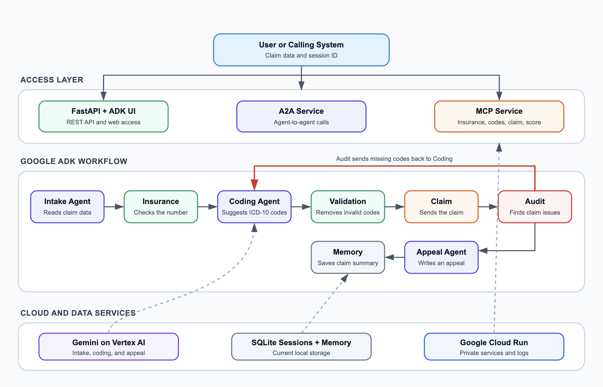

# Healthcare Revenue Cycle Automation with Google ADK

<p align="center">
  
  
  
  
  
  
  
  
  
</p>

## Business Problem

Healthcare teams often check insurance, choose billing codes, send claims, and handle rejected claims by hand. This work can be slow. Missing data or a wrong code can delay payment or cause lost revenue.

The work may also be split across many systems. Staff must repeat steps and find errors after a claim has failed.

## How It Solves the Problem

This system puts the main billing steps in one workflow. It reads claim data, checks the insurance number, suggests ICD-10 codes, sends a test claim, and checks the result. If codes are missing, it tries the coding step again. If a claim is rejected, it writes an appeal letter. It also saves a short claim summary for later use.

Google ADK controls the workflow and the agents. Gemini helps with intake, coding, and appeal writing. Fixed rules check important results. The Agent2Agent (A2A) Protocol lets other agents use the workflow. The Model Context Protocol (MCP) makes billing tools available to MCP clients. FastAPI supports normal web apps, and Gradio gives users a simple web screen. Google Cloud Run hosts the services.

This is a technical prototype. It is not a medical product and must not be used for real clinical or billing decisions.

 

## How a Claim Moves Through the System

The system processes a claim in these steps:

1. The Intake Agent reads the patient ID, insurance number, and visit reason.
2. A fixed rule checks the insurance number.
3. The Coding Agent suggests codes from an approved ICD-10 catalog.
4. Validation removes unsupported codes.
5. An async claim step acts like a slow outside billing API.
6. The Audit step lists problems and gives an issue score.
7. Missing codes go back to coding, up to two times.
8. The Appeal Agent writes a letter for a rejected claim.
9. The Memory step stores a short claim summary.

Gemini is used for intake, coding, and appeal writing. Local rules and templates are used if Gemini is unavailable.

## Architecture

<p align="center">
  
</p>

## Main features

### Multi-agent workflow

- Intake Agent parses the request.
- Coding Agent suggests diagnosis codes.
- Appeal Agent writes a short appeal when needed.
- Python workflow nodes handle insurance, validation, claim submission, audit, retry, and memory.
- Pydantic models pass typed data between every step.

### Model Context Protocol (MCP) tools

`mcp_server.py` uses `FastMCP` from the official MCP Python SDK. MCP clients can discover and call these tools:

- `verify_insurance`
- `search_code_catalog`
- `submit_claim`
- `calculate_issue_score`

The server supports stdio for local MCP clients and Streamable HTTP at `/mcp` for Cloud Run.

### Agent2Agent (A2A) protocol

`a2a_server.py` uses ADK `to_a2a()` to expose the complete workflow through the Agent2Agent Protocol. ADK creates the agent card and A2A routes. This allows another agent to discover the service and send work to it.

The `POST /a2a/rcm` route is a separate compatibility API. It accepts normal JSON and is useful for applications that do not use the A2A Protocol.

### Long-running operation

Claim submission uses `asyncio.sleep()` to represent network delay without blocking the server. It returns an operation ID and a claim ID when successful.

### Sessions and memory

- ADK sessions are stored through `DatabaseSessionService`.
- A caller can send the same session ID to continue a session.
- Workflow history records each important decision.
- The last 500 characters are saved as compact context.
- Claim memory is stored in SQLite and can be viewed at `GET /memory`.

SQLite is suitable for local testing. Use Cloud SQL or Agent Runtime for durable production storage on Google Cloud.

### Checks and logs

- The Audit step checks insurance, codes, review needs, and rejected status.
- `issue_score` is the number of audit issues.
- Missing codes start a coding retry.
- Logs are written as JSON, so Cloud Logging can read them easily.
- Tests cover submission, rejection, retry, fallback parsing, context compaction, and memory.

### Code structure

- `models.py` holds the Pydantic data models.
- `core.py` holds the billing rules.
- `agent.py` holds the Google ADK workflow.
- `runtime.py` runs the workflow and manages sessions.
- `main.py` holds the API routes.
- `gradio_app.py` holds the user interface.
- `mcp_server.py` uses `FastMCP`, so there is no manual protocol code.

## Project structure

```text
healthcare-revenue-cycle-agent/
├── .dockerignore
├── .env.example
├── .python-version
├── assets/
│   └── architecture.png
├── rcm_agent/
│   ├── __init__.py
│   ├── agent.py
│   ├── core.py
│   ├── logging_config.py
│   ├── memory.py
│   └── models.py
├── tests/
│   ├── test_core.py
│   └── test_memory.py
├── a2a_server.py
├── gradio_app.py
├── main.py
├── mcp_server.py
├── runtime.py
├── Dockerfile
├── README.md
├── deploy.sh
├── pyproject.toml
├── ai_rcm_agent_v2.ipynb
└── uv.lock
```

## Steps to Run the Project

You need `uv`, Google Cloud CLI, and a Google Cloud project with billing turned on. The project uses Python 3.12.

### 1. Open the project folder

```bash
cd rcm-adk-google-cloud
```

### 2. Install the project packages

```bash
uv sync
```

`uv` creates `.venv` and installs the locked package versions.

### 3. Set your Google Cloud project

Copy the example settings file:

```bash
cp .env.example .env
```

Open `.env`. Replace `your-project-id` with your Google Cloud project ID.

### 4. Sign in to Google Cloud

```bash
gcloud auth application-default login
gcloud config set project YOUR_PROJECT_ID
```

Replace `YOUR_PROJECT_ID` with the same project ID.

### 5. Run the tests

```bash
uv run pytest
```

### 6. Start the app

```bash
uv run uvicorn main:app --reload --env-file .env
```

### 7. Open the app

- ADK interface: `http://localhost:8000`
- Gradio interface: `http://localhost:8000/ui`
- API docs: `http://localhost:8000/docs`

## Send a Test API Request

Keep the app running. Open a second terminal and run:

```bash
curl -X POST http://localhost:8000/a2a/rcm \
  -H "Content-Type: application/json" \
  -d '{
    "patient_id": "P001",
    "insurance_number": "AET123456",
    "visit_reason": "Type 2 diabetes and high blood pressure"
  }'
```

Use the returned `session_id` in the next request to continue the session.

## Run the Agent2Agent (A2A) Service

```bash
uv run uvicorn a2a_server:app --host 0.0.0.0 --port 8001 --env-file .env
```

Google ADK generates the agent card and A2A endpoints.

## Run the Model Context Protocol (MCP) Service

Stdio mode:

```bash
uv run python mcp_server.py
```

Streamable HTTP mode:

```bash
MCP_TRANSPORT=http PORT=8002 uv run python mcp_server.py
```

The Streamable HTTP MCP endpoint is `http://localhost:8002/mcp`.

## Google Cloud Deployment

The script deploys three private Cloud Run services:

- Main ADK API and Gradio UI
- A2A protocol service
- MCP protocol service

```bash
gcloud auth login
export GOOGLE_CLOUD_PROJECT="your-project-id"
export GOOGLE_CLOUD_LOCATION="us-central1"
chmod +x deploy.sh
./deploy.sh
```

Replace `your-project-id` before you run the script. The script turns on the needed Google Cloud APIs, creates a service account, and deploys the three services.

Use a Cloud Run proxy to open a private service locally:

```bash
gcloud run services proxy rcm-adk-service \
  --project "$GOOGLE_CLOUD_PROJECT" \
  --region "$GOOGLE_CLOUD_LOCATION"
```

## TODOs

1. Connect an insurance eligibility API and a claim clearinghouse in a safe test environment.
2. Use an approved ICD-10 and CPT data source. Require a medical coder to approve codes before a claim is sent.
3. Move sessions and memory to Cloud SQL. Add IAM, Secret Manager, and encrypted audit logs.
